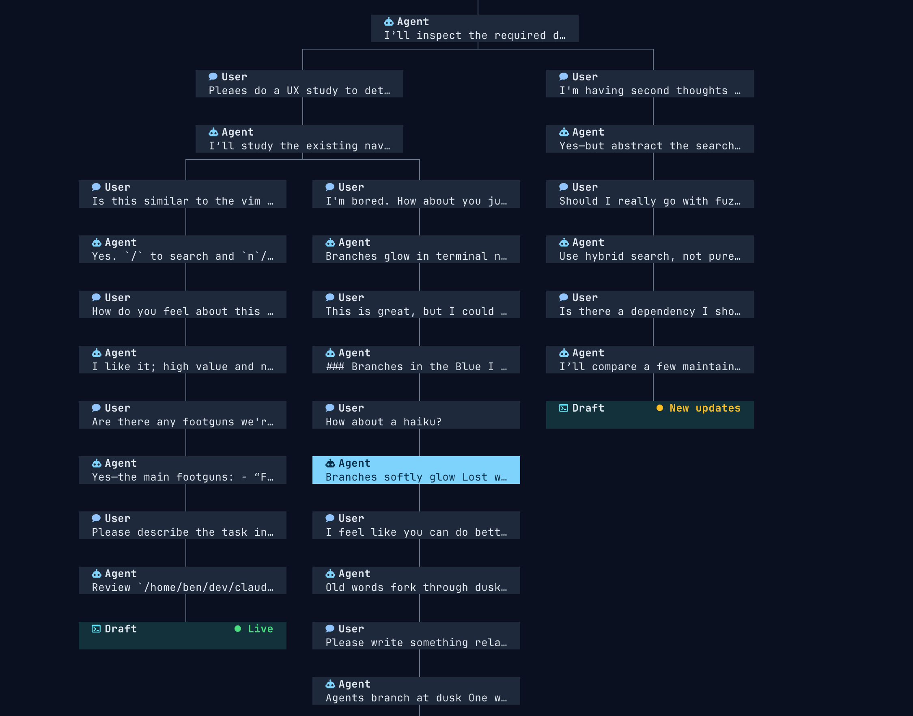

# claude-tree

`/tree` (from `pi` agent) for Claude Code and other agents.

`claude-tree` turns a project's agent conversations into a navigable message tree, making it much easier to manage large & winding sessions without a long, linear history. Sessions that are out of view keep running in the background in their provider's native interface.

<p align="center">
  
</p>

Claude Code is selected by default. Pass `--codex` to use Codex, and optionally pass the project directory:

```sh
claude-tree /path/to/project
claude-tree --codex /path/to/project
```

`claude-tree` does not create Git worktrees or restore files to their state at the fork point.

Confirmed forks open without waiting for ancestry verification. The navigator shows a provisional, unverified branch while its copied history is checked in the background. Unavailable history keeps that provisional placement; contradictory copy evidence moves the child to an independent tree without stopping its terminal. Use `e details` for warnings and Refresh to retry unavailable verification—neither creates another fork. Shared history is merged only after ancestry is verified and saved. Provisional placement and verification evidence last only for the current invocation; an unresolved child remains independently resumable after restart.

## Quick Start

`claude-tree` is project-scoped. Run it inside your project folder.

### Bun

Requires Linux or macOS, Bun, Claude Code or Codex on `$PATH`, and a truecolor terminal using a nerdfont.

```sh
bun add --global github:benkoppe/claude-tree

cd /path/to/project
claude-tree
```

This installs the current `main` branch. Run the install command again to update it.

If the command is not found after installation, add `$BUN_INSTALL/bin` (normally `$HOME/.bun/bin`) to `$PATH`.

On musl Linux, set `OPENTUI_LIBC=musl` when running `claude-tree`.

### Nix

```sh
nix run github:benkoppe/claude-tree
```

If provider CLIs are already installed separately, use `#unwrapped` to keep the existing commands on `$PATH`:

```sh
nix run github:benkoppe/claude-tree#unwrapped
```

## Development

The development shell includes Bun and the validated provider CLIs available for the platform:

```sh
nix develop
bun install --frozen-lockfile
bun run check # or nix flake check
bun run start
```

Without Nix, install Bun and at least one supported provider CLI before running the last three commands.

After changing `bun.lock`, regenerate the Nix dependency set with `nix develop -c bun2nix -o bun.nix`.
